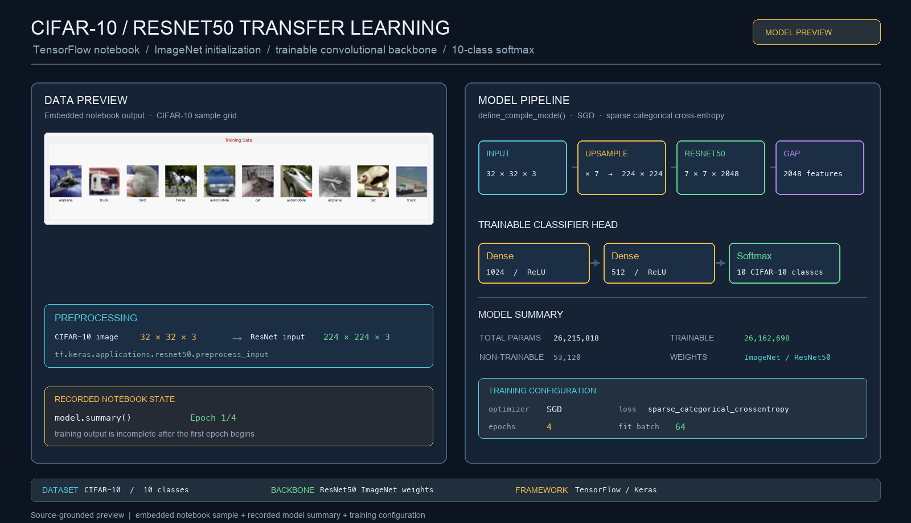
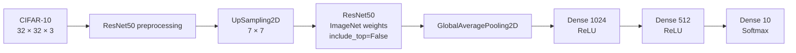

# CIFAR-10 ResNet50 Transfer Learning

> **Recommended repository name:** `cifar10-resnet50-transfer-learning`
>
> **About:** TensorFlow CIFAR-10 image classifier using ImageNet-initialized ResNet50 features, input upsampling, a trainable dense classification head, and notebook-based evaluation.



## Overview

This project explores image classification on CIFAR-10 with TensorFlow and Keras. The notebook loads 32×32 RGB images, applies ResNet50 preprocessing, upsamples each image to 224×224, and passes it through an ImageNet-initialized ResNet50 backbone without its original classification head.

The project demonstrates **transfer learning for computer vision**: a network trained on a large image corpus provides reusable visual features, while additional dense layers map those features to the ten CIFAR-10 classes. In the current notebook, the ResNet50 weights remain trainable, so the experiment is closer to fine-tuning a pretrained backbone than using it as a frozen feature extractor.

## Model pipeline



The recorded model summary contains:

- Input shape: `32 × 32 × 3`
- Upsampled shape: `224 × 224 × 3`
- ResNet50 output: `7 × 7 × 2048`
- Global average pooled features: `2048`
- Classifier head: `1024 → 512 → 10`
- Total parameters: `26,215,818`
- Trainable parameters: `26,162,698`
- Non-trainable parameters: `53,120`

## Dataset and preprocessing

The notebook uses `tf.keras.datasets.cifar10.load_data()` and defines the standard ten classes:

| Label | Class |
| --- | --- |
| 0 | airplane |
| 1 | automobile |
| 2 | bird |
| 3 | cat |
| 4 | deer |
| 5 | dog |
| 6 | frog |
| 7 | horse |
| 8 | ship |
| 9 | truck |

The preprocessing function converts images to `float32` and applies `tf.keras.applications.resnet50.preprocess_input`. Because ResNet50 expects 224×224 inputs, `UpSampling2D(size=(7, 7))` expands each CIFAR-10 image before feature extraction.

## Training configuration

The notebook compiles the model with:

```python
optimizer = "SGD"
loss = "sparse_categorical_crossentropy"
metrics = ["accuracy"]
epochs = 4
fit_batch_size = 64
```

The notebook declares `BATCH_SIZE = 32` earlier, but the training call uses `batch_size=64`; the README records the value actually passed to `model.fit`.

The dataset variable named `validation_images` is populated from the second return value of `cifar10.load_data()`, which is the CIFAR-10 test split. A future revision should rename that variable or create a separate validation split so the evaluation protocol is explicit.

## Notebook workflow

1. Import TensorFlow, Keras ResNet50, NumPy, Matplotlib, and image utilities.
2. Load CIFAR-10 and display a labeled sample grid.
3. Preprocess training and test images for ResNet50.
4. Build the upsampling, backbone, pooling, and dense classifier layers.
5. Compile and summarize the model.
6. Train for four epochs with the configured batch size.
7. Evaluate loss and accuracy on the held-out split.
8. Plot training/test loss and accuracy.
9. Display predicted classes alongside sample images.

## Getting started

Install the notebook dependencies in a virtual environment:

```bash
python -m venv .venv
source .venv/bin/activate
python -m pip install --upgrade pip
python -m pip install tensorflow tensorflow-datasets matplotlib numpy pillow jupyter
```

Launch Jupyter:

```bash
jupyter notebook Transfer_Learning_Image_Calssification_ResNet50.ipynb
```

The notebook also works as a Colab-style experiment. The `%tensorflow_version 2.x` cell is legacy Colab syntax and has no effect in current TensorFlow environments.

Training downloads the CIFAR-10 data and ImageNet ResNet50 weights, so it requires network access, substantial memory, and time for the convolutional backbone.

## Repository map

| Path | Responsibility |
| --- | --- |
| `Transfer_Learning_Image_Calssification_ResNet50.ipynb` | End-to-end data, model, training, evaluation, and visualization workflow |
| `README.md` | Project documentation and reproducibility notes |
| `docs/resnet50-transfer-learning-pipeline.png` | Source-grounded model and training preview |

## Implementation notes

- The ResNet50 backbone is created with `include_top=False` and `weights="imagenet"`.
- No `trainable=False` setting is applied, so most backbone weights are trainable.
- CIFAR-10 images are resized by nearest-neighbor-style upsampling rather than by collecting native 224×224 images.
- The dense head uses `GlobalAveragePooling2D`, `Flatten`, `Dense(1024, relu)`, `Dense(512, relu)`, and `Dense(10, softmax)`.
- The notebook contains plotting helpers for loss and accuracy, but the committed execution output stops when `Epoch 1/4` begins. No completed accuracy, loss, or confusion-matrix result is claimed here.
- The model is computationally heavy for CIFAR-10 because every small image is expanded before passing through ResNet50. A frozen-backbone comparison would provide a useful efficiency baseline.

## Engineering roadmap

- Freeze the backbone for a baseline, then compare it with staged unfreezing and lower learning rates.
- Create an explicit train/validation/test split instead of naming the CIFAR-10 test set as validation data.
- Add deterministic seeds and record the exact TensorFlow, CUDA, and GPU environment.
- Save model checkpoints and export final metrics, confusion matrices, and per-class precision/recall.
- Add data augmentation appropriate for CIFAR-10 and compare it with the current preprocessing-only pipeline.
- Use a smaller backbone or native CIFAR-sized architecture for faster local experiments.
- Remove unused imports and separate notebook utilities from model-definition cells for easier reuse.

## Verification

The notebook structure was inspected against the checked-in source. The generated preview uses the embedded CIFAR-10 sample output and the recorded Keras model summary; it does not invent final training metrics.
